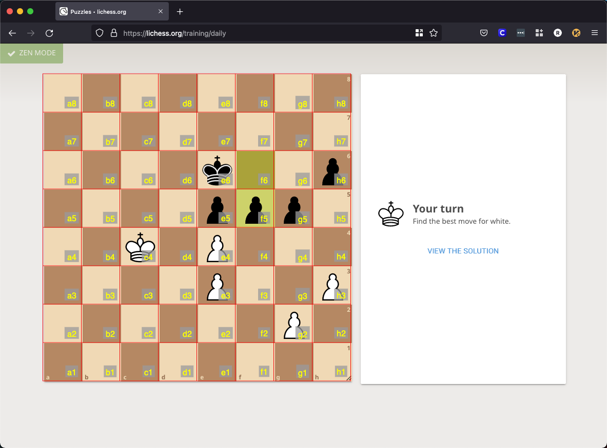

# Chess Grid

Chess Grid is an interactive voice-command chess tool intended to be used with the
[Talon Voice framework](https://talonvoice.com/).

Chess Grid will allow you to use voice commands to move pieces on any chess board, such as this one from Lichess:

By saying the command `chess grid`, the chess board will be automatically detected and a grid will be overlaid on top of it:

Never fear! You can then hide the grid with the command `chess hide`.

You would then be able to move pieces with a command such as `mark each four fine five` to move the pawn from E4 to F5.
