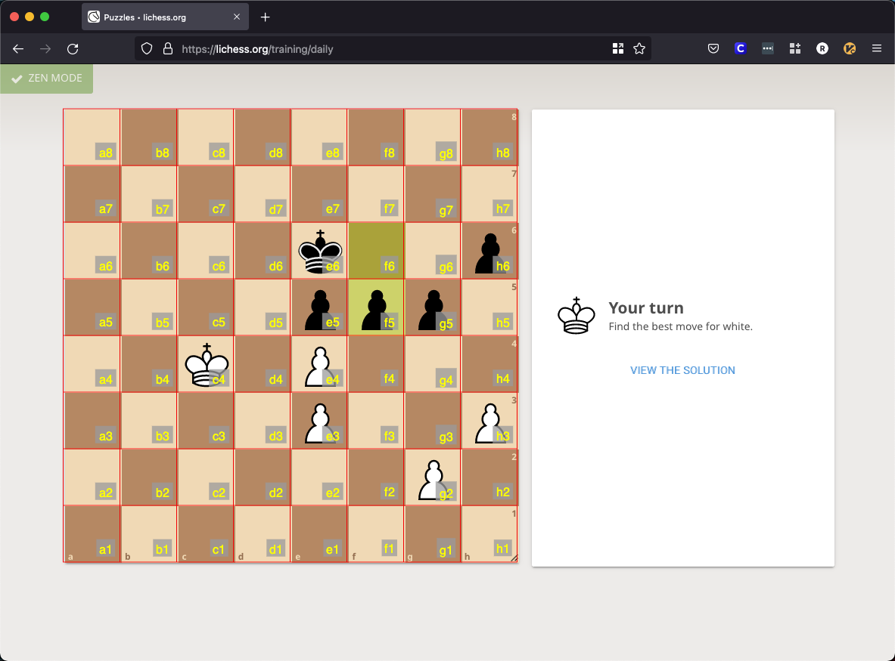

# Chess Grid

## Overview
Chess Grid is an interactive voice-command chess tool intended to be used with the
[Talon Voice framework](https://talonvoice.com/).

Chess Grid allows you to use voice commands to move pieces on any chess board. It is capable of automatically detecting the chessboard, detecting the pieces, and making chess moves through voice commands!

## Normal Use
1. Open any chess website or chess desktop app, such as [Lichess](https://lichess.org)
1. With the board in its starting position, use the voice command `chess reference white` to find the chessboard and detect the pieces (`white` such that it knows you are the white player)
1. Now issue a move with the voice command `white each four` which will move white's pawn from e2 to e4

### Tips
- Make moves using [standard algebraic notation (SAN)](https://en.wikipedia.org/wiki/Algebraic_notation_(chess)), e.g.:

    `white near cap three` -> move white's knight to c3

    `black red air drum eight` -> move black's rook on the a-file to d8

    `white odd dash odd` -> short castle as white

- You may not need to run `chess reference` at the start of every game. As long as you are using the same website, piece set, and haven't repositioned the window, the board and pieces should be detected successfully. You can always use the commands `chess white` and `chess black` to reorient the board if you switch sides between games.
- The command `chess reference` will still work even if an initial pawn move has been made. For instance, if you are black and white has already taken their first move 1. e4, `chess reference` will still work since the pawn it looks for is the a-file pawn.
- In case the need for debugging a situation arises, check the talon logs. The command `chess detect` will print a view of the board as it understands it in the logs, or else mention any issue it encounters.
- Check out the talon files to see the other commands that are available.

## Manual Mode
Chess Grid can be used in a slightly more manual mode. For instance here is a board from Lichess:

By saying the command `chess grid`, the chess board will be automatically detected and a grid will be overlaid on top of it:

Never fear! You can then hide the grid with the command `chess hide`.

You can move any piece with a command such as

`manual each four fine five`

to move the pawn (or whatever piece is there) from e4 to f5.

## To Do
- Provide a minimal overlay that gives some visual feedback
- Handle promotion and the pawn/bishop edge case
